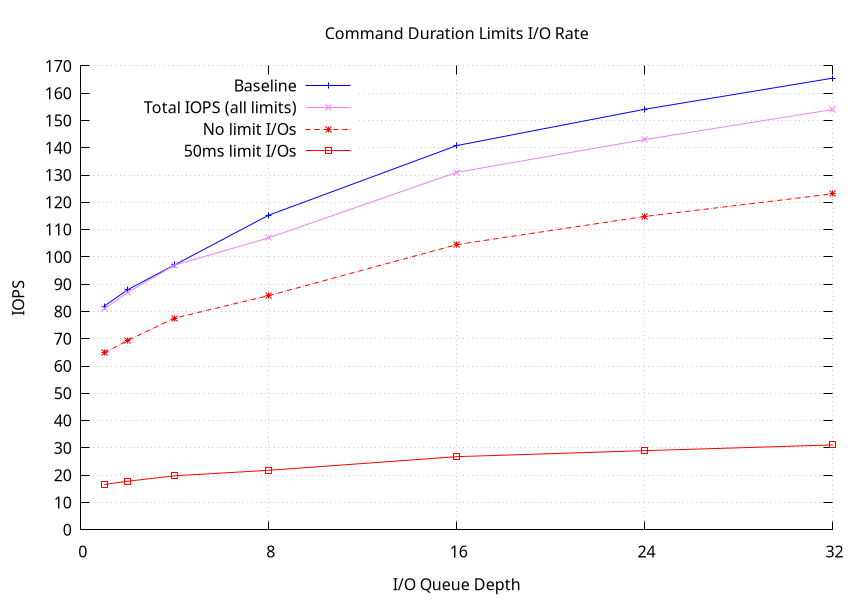
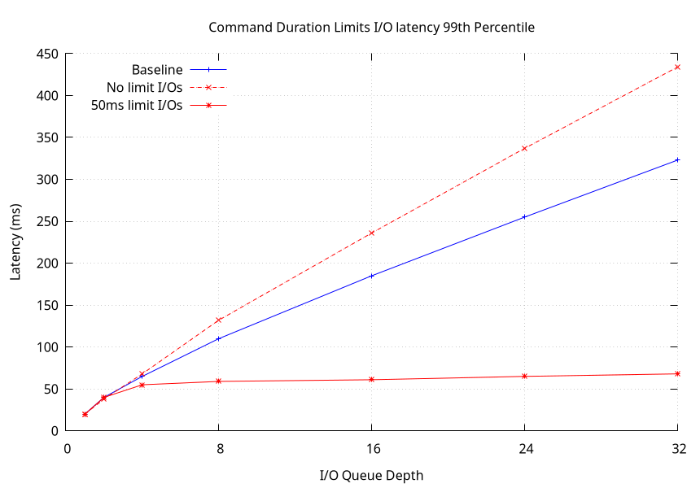
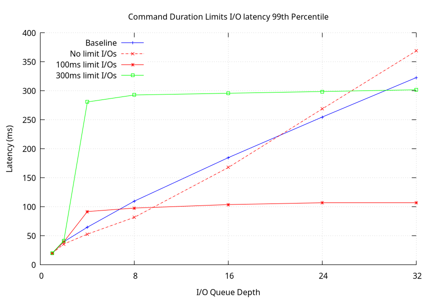

Copyright (C) 2023, Western Digital Corporation or its affiliates.

# <p align="center">CDL Benchmark</p>

The *cdl_bench.sh* shell script allow executing random read workloads to
evaluate a drive performance with and without CDL.

## Overview

The usage of the *cdl_bench.sh* script is as follows.

```
$ ./cdl_bench.sh
Usage: cdl_bench.sh [Options]
Options:
  -h | --help      : Print this help message
  --dev <file>     : Specify the target device
  --bs <size>      : Random read IO size (default: 131072)
  --ramptime <sec> : Specify the ramp time (seconds) for each run
                     (default: 60)
  --runtime <sec>  : Specify the run time (seconds) for each run
                     (default: 300)
  --qds <list>     : Specify the list of queue depths to use,
                     E.g. "1 2 4 8 16 32" (default: "1 2 4 8 16 24 32")
  --outdir <dir>   : Save the run results in <dir>. <dir> must not exist.
                     (default: /root/<dev name>_cdl_bench)
  --baseline       : Run baseline workload
  --ncq-prio       : Use NCQ priority workload
  --cdl-single     : Run CDL workload with a single limit
  --cdl-multi      : Run CDL workload with multiple limits
  --percentage <p> : For ncq-prio and cdl-single runs, specify the
                     percentage of commands with a high-priority/limit
  --dld <index>    : For a cdl-single run, specify the descriptor index
                     to use
  --dldsplit <str> : For a cdl-multi run, comma separated list of the
                     CDL descriptors to use with the percentage of I/Os
                     E.g. "1/10,2/20" for 10% of I/Os with CDL 1,
                     20% of I/Os with CDL 2 and the remaining I/Os
                     (70%) with no limit.
  --t2a <file>     : For cdl-single and cdl-multi runs, specify the
                     T2A CDL descriptor page to use.
                     (default cdl-tools/benchmark/scripts/T2A.cdl)
  --t2b <file>     : For cdl-single and cdl-multi runs, specify the
                     T2B CDL descriptor page to use.
                     (default cdl-tools/benchmark/scripts/T2B.cdl)
```

A version of *fio* including CDL support must be installed to execute
*cdl_bench.sh*. CDL support is included in [upstream
fio](https://github.com/axboe/fio).

## Executing Workloads

As described above, *cdl_bench.sh* allows executing diferent workloads:
    * Baseline workload: regular random read I/Os
    * NCQ priority workload: random read I/Os with a certain percentage executed
      as high priority
    * CDL single limit workload: random read I/Os with a certain percentage
      executed with a duration limit
    * CDL multiple limits workload: random read I/Os with different duration
      limits applied to different percentages of I/Os.

### Baseline Workload

The option *--baseline* of *cdl_bench.sh* execute by default a random 128KB read
workload at different wueue depth to establish a baseline performance for
comparing results when using CDL.

```
$ ./cdl_bench.sh --baseline --dev /dev/sdh
Run on /dev/sdh, ramp time: 60s, run time: 300s
  Output directory: /root/sdh_cdl_bench

Device: /dev/sdh
    Vendor: ATA
    Product: XYZ
    Revision: abc
    42970644480 512-byte sectors (22.000 TB)
    Device interface: ATA
      SAT Vendor: linux
      SAT Product: libata
      SAT revision: 3.00
    Command duration limits: supported, disabled
    Command duration guidelines: supported
    High priority enhancement: supported, disabled
    Duration minimum limit: 20000000 ns
    Duration maximum limit: 4294967295000 ns
System:
    Node name: xxx
    Kernel: Linux 6.5.0-rc5 #150 SMP PREEMPT_DYNAMIC Fri Aug 11 17:46:27 JST 2023
    Architecture: x86_64
    Command duration limits: supported, disabled
    Device sdh command timeout: 30 s

Running baseline workload
  QD=1...
  QD=2...
  QD=4...
  QD=8...
  QD=16...
  QD=24...
  QD=32...
```

### NCQ High Priority Workload

Again in order to allow comparison with CDL workloads, *cdl_bench.sh* allows
executing the same random read workload as the baseline with a certain
percentage of I/Os using NCQ high priority. This is applicable only to ATA
devices that support the NCQ priority feature.

To run this workload, the option *--ncqprio* must be used together with the
*--percentage* option to specify the percentage of I/Os that must be executed
with a high priority. The example below shows an execution with 20% of I/Os
using high priority.

```
$ ./cdl_bench.sh --ncq-prio --percentage 20 --dev /dev/sdh
Run on /dev/sdh, ramp time: 60s, run time: 300s
  Output directory: /root/sdh_cdl_bench

Device: /dev/sdh
    Vendor: ATA
    Product: XYZ
    Revision: abc
    42970644480 512-byte sectors (22.000 TB)
    Device interface: ATA
      SAT Vendor: linux
      SAT Product: libata
      SAT revision: 3.00
    Command duration limits: supported, disabled
    Command duration guidelines: supported
    High priority enhancement: supported, disabled
    Duration minimum limit: 20000000 ns
    Duration maximum limit: 4294967295000 ns
System:
    Node name: xxx
    Kernel: Linux 6.5.0-rc5 #150 SMP PREEMPT_DYNAMIC Fri Aug 11 17:46:27 JST 2023
    Architecture: x86_64
    Command duration limits: supported, disabled
    Device sdh command timeout: 30 s

Running NCQ priority workload
  QD=1...
  QD=2...
  QD=4...
  QD=8...
  QD=16...
  QD=24...
  QD=32...
```

The data generated by this command is by default saved in the user home
directory (/root when executing as root) in the directory
*<dev name>_cdl_bench/ncqprio*.

### Single Limit CDL Workload

To execute a workload with a certain percentage of I/Os using a duration limit,
the option *--cdl-single* must be used together with the *--percentage* option
and the *--dld* option to specify the index (number) of the descriptor index
to apply to the specified percentage of I/Os. The following command is an
example of a CDL run with 20% of I/Os using the limit descriptor 1.

```
$ ./cdl_bench.sh --cdl-single --percentage 20 --dld 1 --dev /dev/sdh
Run on /dev/sdh, ramp time: 60s, run time: 300s
  Output directory: /root/sdh_cdl_bench

Device: /dev/sdh
    Vendor: ATA
    Product: XYZ
    Revision: abc
    42970644480 512-byte sectors (22.000 TB)
    Device interface: ATA
      SAT Vendor: linux
      SAT Product: libata
      SAT revision: 3.00
    Command duration limits: supported, disabled
    Command duration guidelines: supported
    High priority enhancement: supported, disabled
    Duration minimum limit: 20000000 ns
    Duration maximum limit: 4294967295000 ns
System:
    Node name: xxx
    Kernel: Linux 6.5.0-rc5 #150 SMP PREEMPT_DYNAMIC Fri Aug 11 17:46:27 JST 2023
    Architecture: x86_64
    Command duration limits: supported, disabled
    Device sdh command timeout: 30 s
Uploading T2A CDL page
Uploading T2B CDL page

Running CDL workload, single limit
  QD=1...
  QD=2...
  QD=4...
  QD=8...
  QD=16...
  QD=24...
  QD=32...
```

Of note are the messages mentioning uploading the T2A and T2B CDL descriptor
pages. By default, the pages T2A.cdl and T2B.cdl under
cdl-tools/benchmark/scripts are used. These pages define duration guideline
limits of 50ms, 100ms, 200ms, 300ms, 400ms and 500ms. Different limits can be
used by specifying the CDL descriptor pages to use with the options *--t2a* and
*--t2b*.

### Multiple Limits CDL Workload

Workloads using multiple duration limits can be executed using the option
*--cdl-multi*. This option also requires the option *--dldsplit* to specify
as a comma separated list the different duration limit descriptors to use and
the percentage of I/Os using the limits.

For example, the following command illustrates how to execute a workload with
10% of I/Os using the limit descriptor 2 (100ms limit by default), 20% of I/Os
using the limit descriptor 4 (300ms limit by default), and the remaining 70%
of I/Os with no limit.

```
$ ./cdl_bench.sh --cdl-multi --dldsplit "2/10,4/20" --dev /dev/sdh
Run on /dev/sdh, ramp time: 60s, run time: 300s
  Output directory: /root/sdh_cdl_bench

Device: /dev/sdh
    Vendor: ATA
    Product: XYZ
    Revision: abc
    42970644480 512-byte sectors (22.000 TB)
    Device interface: ATA
      SAT Vendor: linux
      SAT Product: libata
      SAT revision: 3.00
    Command duration limits: supported, disabled
    Command duration guidelines: supported
    High priority enhancement: supported, disabled
    Duration minimum limit: 20000000 ns
    Duration maximum limit: 4294967295000 ns
System:
    Node name: xxx
    Kernel: Linux 6.5.0-rc5 #150 SMP PREEMPT_DYNAMIC Fri Aug 11 17:46:27 JST 2023
    Architecture: x86_64
    Command duration limits: supported, disabled
    Device sdh command timeout: 30 s
Uploading T2A CDL page
Uploading T2B CDL page

Running CDL workload, multiple limits
  QD=1...
  QD=2...
  QD=4...
  QD=8...
  QD=16...
  QD=24...
  QD=32...
```

Similarly to the *--cdl-single* case, the options *--t2a* and *--t2b* can be
used to specify different CDL descriptor pages to use different limits.

The data generated by this command is by default saved in the user home
directory (/root when executing as root) in the directory
*<dev name>_cdl_bench/cdlmulti*.

### Executing Multiple Workloads

A single command line can be used to execute multiple workloads. For example,
the following command combines all the above workload examples as a single
command.

```
$ ./cdl_bench.sh --dev /dev/sdg --baseline --ncq-prio --cdl-single \
    --cdl-multi --percentage 20 --dld 1 --dldsplit "2/10,4/20"
```

## Processing Results

The script *cdl_prio_stats.sh* is provided to extract completion latency
statistics from fio log files generated by the workload runs.
The script *cdl_plots.sh* can also be used to generate different graphs of the
results.

### *fio* Statistics

The script *cdl_prio_stats.sh* extracts I/O completion statistics for a
workload. The example below show the output generated by this script for the
*--cdl-single* run at queue depth 32.

```
$ ./cdl_prio_stats.sh ~/sdg_bench/cdlsingle/32/randread.log_lat.log
Priority 0x0000, class NONE, level 0, hint 0 (79.82 %):
    IOPS=123.2, BW=15.4MiB/s (16.1MB/s)(4625MiB/300245msec)
    lat (msec): min=8, max=544, avg=250.07, stdev=101.62
    lat percentiles (msec):
     |  1.00th=[   21],  5.00th=[   58], 10.00th=[   98], 20.00th=[  158],
     | 30.00th=[  201], 40.00th=[  235], 50.00th=[  264], 60.00th=[  291],
     | 70.00th=[  314], 80.00th=[  340], 90.00th=[  373], 95.00th=[  397],
     | 99.00th=[  434], 99.50th=[  443], 99.90th=[  460], 99.95th=[  465],
     | 99.99th=[  514]
Priority 0x4008, class BE, level 0, hint 1 (20.17 %):
    IOPS=31.1, BW=3.8MiB/s (4.0MB/s)(1168MiB/300245msec)
    lat (msec): min=6, max=88, avg=33.73, stdev=14.64
    lat percentiles (msec):
     |  1.00th=[   13],  5.00th=[   16], 10.00th=[   17], 20.00th=[   20],
     | 30.00th=[   23], 40.00th=[   26], 50.00th=[   30], 60.00th=[   35],
     | 70.00th=[   41], 80.00th=[   49], 90.00th=[   56], 95.00th=[   60],
     | 99.00th=[   68], 99.50th=[   72], 99.90th=[   77], 99.95th=[   81],
     | 99.99th=[   86]
```

## Plotting Results

The script *gen_plot.sh* processes all fio I/O logs to generate plots of various
metrics. The plots generated are as follows.

    * IOPS as a function of the queue depth.
    * Average I/O latency as a function of the queue depth
    * 99th percentile of the I/O latency as a function of the queue depth
    * Latency distribution function for each queue depth

If a workload has I/Os with different priorities or limits, the metrics for
each class of I/O are also plotted.

### Overview

*gen_plot.sh* can either generate plots as interactive windows on the screen or
save the plots as png files in the data directory specified.

```
$ ./cdl_plots.sh 
Usage: cdl_plots.sh [Options] <data dir>
Options:
  -h | --help  : Print this help message
  --save       : Save plots to png files instead of displaying them
  --w <width>  : Set plot width (default: 800)
  --h <height> : Set plot height (default: 600)
```

*gnuplot* must be installed prior to executing *gen_plot.sh*.

If the option *--save* is not specified, *cdl_plot.sh* generates the plots and
displays them in new windows on screen. Otherwise, the plots are save as png
image files in the directory *<data_dir>/plots*.

### Example

Processing the results for the 4 different workload examples above (baseline,
ncq-prio, cdl-single and cdl-multi), the execution of *gen_plot.sh* generates
the following output.

```
# ./cdl_plots.sh --save ~/sdg_cdl_bench
Processing baseline results
  QD=1, QD=2, QD=4, QD=8, QD=16, QD=24, QD=32
  Plotting IOPS
  Plotting latency average
  Plotting latency 99th percentile
  Plotting latency distribution
Processing NCQ priority results...
  QD=1, QD=2, QD=4, QD=8, QD=16, QD=24, QD=32
  Plotting IOPS
  Plotting latency average
  Plotting latency 99th percentile
  Plotting latency distribution, class NONE, level 0, hint 0
  Plotting latency distribution, class RT, level 0, hint 0
Processing CDL results, single limit...
  QD=1, QD=2, QD=4, QD=8, QD=16, QD=24, QD=32
  Plotting IOPS
  Plotting latency average
  Plotting latency 99th percentile
  Plotting latency distribution, class NONE, level 0, hint 0
  Plotting latency distribution, class BE, level 0, hint 1
Processing CDL results, multiple limits...
  QD=1, QD=2, QD=4, QD=8, QD=16, QD=24, QD=32
  Plotting IOPS
  Plotting latency average
  Plotting latency 99th percentile
  Plotting latency distribution, class NONE, level 0, hint 0
  Plotting latency distribution, class BE, level 0, hint 2
  Plotting latency distribution, class BE, level 0, hint 4
```

The plot for the I/O rate for the cdl-single workload shows that using CDL comes
at the cost of a small degradation of the maximum IOPS compared to the baselin
workload.



However, the plot for the 99th percentile of I/O latencies of the same workload
illustrates how CDL helps control the tail latency of I/Os, even at high queue
depth.



The plot for the 99th percentile of I/O latencies of the CDL workload using
multiple limits shows how CDL allows spearating I/Os into different service
classes.



